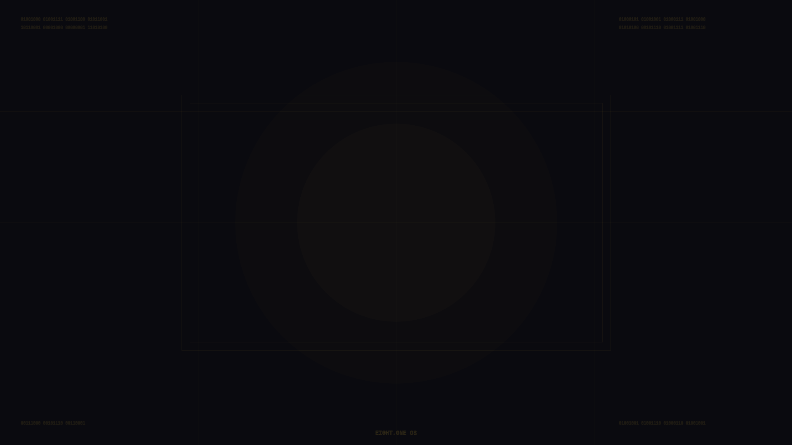

<p align="center">
  
</p>

<h1 align="center">EIGHT.ONE OS</h1>
<h3 align="center">∞ Infinity One — A Holy Developer Distribution</h3>

<p align="center">
  
  
  
  
  
</p>

<p align="center">
  <b>A keyboard-driven, AI-integrated, spiritually-inspired Arch Linux distribution built for developers who code with purpose.</b>
</p>

---

## ✨ What is EIGHT.ONE OS?

EIGHT.ONE OS (Infinity One) is a custom Arch Linux distribution designed for developers who value **focus**, **craftsmanship**, and **intentional computing**. Built with `archiso`, it ships a complete, opinionated development environment out of the box — no post-install grind required.

Every design choice is deliberate: a keyboard-only workflow enforces deep focus, local AI keeps your data private, and integrated spiritual tools remind you that there's more to life than code.

## 🏆 Why EIGHT.ONE Over Omarchy?

| Feature | Omarchy | EIGHT.ONE OS |
|---|:---:|:---:|
| Hyprland + Waybar | ✅ | ✅ |
| Neovim (LazyVim IDE) | ✅ | ✅ |
| Custom Branded Wallpaper | ✅ | ✅ |
| Glassmorphism UI Theme | ❌ | ✅ |
| **Local AI Assistant (Ollama)** | ❌ | ✅ |
| **Integrated Bible Search** | ❌ | ✅ |
| **Monastic Mode (Distraction Blocker)** | ❌ | ✅ |
| **Holy Vibes (Focus Audio)** | ❌ | ✅ |
| **Sabbath Reminder** | ❌ | ✅ |
| **Lock Screen with Bible Verses** | ❌ | ✅ |
| **Code Formatting (Prettier + Black)** | ❌ | ✅ |
| Screenshot + Clipboard Manager | ✅ | ✅ |
| Notification Daemon | ✅ | ✅ |

## 🖥️ Desktop Environment

EIGHT.ONE OS ships a fully configured **Hyprland** Wayland compositor with:

- **Gold & Black** glassmorphism theme across all components
- **Waybar** with CPU, RAM, disk, network, battery, Sabbath indicator
- **Alacritty** terminal with transparency, JetBrains Mono Nerd Font
- **Fuzzel** app launcher
- **Mako** notification daemon with themed popups
- **Hyprlock** lock screen with the 8.1 logo and a random Bible verse
- **Hyprpaper** with the custom EIGHT.ONE branded wallpaper
- Smooth animations, blur effects, and rounded corners

## ⌨️ Keyboard Shortcuts

### Core
| Shortcut | Action |
|---|---|
| `Super + Enter` | Open Terminal |
| `Super + Space` | App Launcher |
| `Super + Q` | Close Window |
| `Super + Shift + E` | Exit Hyprland |
| `Super + F` | Fullscreen |
| `Super + Shift + F` | Toggle Float |

### Holy Tools
| Shortcut | Action |
|---|---|
| `Super + A` | 🤖 AI Assistant (Ollama) |
| `Super + B` | 📖 Bible Search (fzf) |
| `Super + L` | 🔒 Lock Screen |

### Developer
| Shortcut | Action |
|---|---|
| `Super + S` | 📸 Screenshot (area) |
| `Super + Shift + S` | 📸 Screenshot (full) |
| `Super + V` | 📋 Clipboard History |
| `Super + E` | 📁 File Manager (Yazi) |
| `Super + H/J/K/L` | Focus (vim-style) |
| `Super + 1-9` | Switch Workspace |

## 🛠️ Pre-Installed Developer Tools

### Languages & Build
- **Rust** (rustc, cargo)
- **Python 3** (with black, pip)
- **GCC/G++** (base-devel)
- **Node.js** (with prettier)

### Editor
- **Neovim** with **LazyVim** — full IDE experience with LSP, treesitter, telescope, and more

### Terminal
- **Alacritty** — GPU-accelerated terminal
- **Tmux** & **Zellij** — terminal multiplexers
- **Starship** — cross-shell prompt
- **Zsh** — default shell with custom config

### Modern CLI
- `bat` — cat with syntax highlighting
- `eza` — modern ls replacement
- `ripgrep` — blazing fast search
- `fd` — modern find
- `fzf` — fuzzy finder
- `btop` — system monitor
- `dust` — disk usage analyzer
- `procs` — modern ps replacement
- `yazi` — terminal file manager
- `jq` — JSON processor

## 🙏 Holy Tools

### `holy-bible`
Instant, keyboard-driven scripture search powered by `fzf` and `bat`. Search any verse from the King James Bible without leaving your terminal.

### `holy-ai`
Local AI assistant powered by **Ollama**. Your conversations stay on your machine. No cloud, no tracking, no subscriptions.

### `holy-focus` (Monastic Mode)
Temporarily blocks distracting websites (Reddit, YouTube, X, etc.) by modifying `/etc/hosts` for 120 minutes of deep focus.

```bash
sudo holy-focus        # Enter Monastic Mode
sudo holy-focus stop   # Exit early
```

### `holy-vibes`
Background audio player with three modes:
1. 🕊️ Gregorian Chants
2. 🙏 Christian Lofi Worship
3. 🎧 Deep Focus Synthwave

### `holy-sabbath`
Waybar module that gently reminds you to rest on Sundays. Integrates with desktop notifications.

## 📦 Building the ISO

### Prerequisites
```bash
sudo pacman -S archiso
```

### Build
```bash
cd holy-iso
sudo rm -rf /tmp/archiso-tmp
sudo mkarchiso -v -w /tmp/archiso-tmp -o ./out .
```

### Test with QEMU
```bash
qemu-system-x86_64 -m 4096 -enable-kvm \
  -device virtio-vga-gl -display gtk,gl=on \
  -cdrom out/holy-arch-*.iso
```

### Install on Hardware
Burn the ISO to a USB drive:
```bash
sudo dd bs=4M if=out/holy-arch-*.iso of=/dev/sdX status=progress oflag=sync
```

## 📁 Project Structure

```
holy-iso/
├── packages.x86_64              # All pre-installed packages
├── profiledef.sh                # ISO build profile
├── airootfs/
│   ├── etc/
│   │   ├── skel/                # Default user config
│   │   │   ├── .config/
│   │   │   │   ├── hypr/        # Hyprland + Hyprpaper + Hyprlock
│   │   │   │   ├── waybar/      # Glassmorphism bar
│   │   │   │   ├── alacritty/   # Gold & Black terminal
│   │   │   │   ├── nvim/        # LazyVim IDE
│   │   │   │   └── mako/        # Notifications
│   │   │   ├── .zshrc           # Shell config + 8.1 logo
│   │   │   └── wallpaper.png    # EIGHT.ONE branded wallpaper
│   │   └── systemd/             # Auto-login config
│   ├── root/
│   │   └── customize_airootfs.sh
│   └── usr/local/bin/
│       ├── holy-bible           # Bible search tool
│       ├── holy-ai              # AI assistant wrapper
│       ├── holy-focus           # Distraction blocker
│       ├── holy-vibes           # Background audio
│       ├── holy-sabbath         # Sabbath reminder
│       └── start-hyprland       # Wayland session launcher
└── out/                         # Built ISO output
```

## 🎨 Design Philosophy

> *"Whatever you do, work at it with all your heart, as working for the Lord."* — Colossians 3:23

EIGHT.ONE OS is built on three pillars:

1. **Focus** — Keyboard-only workflow, distraction blocking, and intentional tool selection
2. **Craftsmanship** — Every pixel, every keybinding, every default is chosen with care
3. **Purpose** — Technology should serve you, not consume you

## 📝 License

MIT License — Build upon it, share it, make it your own.

---

<p align="center">
  <b>Built with 🙏 by <a href="https://github.com/Artaeon">Artaeon</a></b><br/>
  <i>"In the beginning was the Word, and the Word was with God, and the Word was God."</i> — John 1:1
</p>
